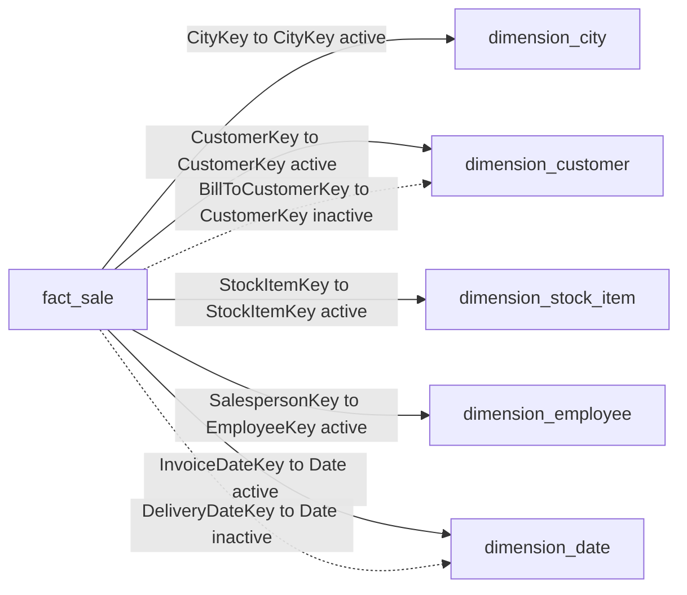

# WideWorldImporters Semantic Model Documentation

## Document Control
| Field | Value |
|---|---|
| Model Name | `WideWorldImporters` |
| Workspace Path | `workspaces/Fabric BI End2End/3_Gold/WideWorldImporters.SemanticModel` |
| Source Type | Direct Lake (`DirectLake - lakehouse_gold`) |
| Compatibility Level | `1604` |
| Culture | `en-US` |
| Generated On | `2026-02-27` |
| Scope | Tables, columns, relationships, hierarchies, measures, semantic conventions |

## 1. Model Purpose And Business Context
The `WideWorldImporters` semantic model is designed as a governed analytics layer for sales performance reporting in Microsoft Fabric.  
It provides a consistent business definition of sales KPIs and dimensional slicing so report authors and consumers can analyze the same numbers across all reports.

Primary purpose:
- Deliver a reusable star-schema model for operational and management reporting.
- Standardize key business metrics such as sales, tax, profit, quantity, and distinct counts.
- Enable reliable slicing by geography, customer, employee (salesperson), product, and time.
- Expose a clean self-service experience by hiding technical keys and grouping user-facing fields.

Analytical intent:
- Support trend analysis over invoice and delivery timelines.
- Support customer and product mix analysis.
- Support performance analysis by territory and salesperson.
- Provide fiscal and calendar time navigation through pre-defined hierarchies.

Intended audience:
- BI developers building reports and dashboards.
- Business analysts performing ad-hoc analysis.
- Data governance and platform teams maintaining semantic consistency.

Modeling approach:
- `fact_sale` as the transactional fact table.
- Conformed dimensions (`dimension_city`, `dimension_customer`, `dimension_employee`, `dimension_stock_item`, `dimension_date`).
- Explicit measures in a dedicated `_Measures` table.
- Controlled relationship activation for alternative analytical paths (`DeliveryDate`, bill-to customer).

## 2. Executive Summary
This model is a star schema centered on `fact_sale`, with conformed dimensions for city, customer, employee, stock item, and date. A dedicated `_Measures` table holds explicit business measures.

Implemented modeling standards:
- Foreign keys and technical columns hidden.
- Default summarization set to `None` for all columns.
- Date and label columns sorted explicitly where required.
- Display folders and descriptions implemented across columns and measures.

## 3. Model Diagram

## 4. Relationship Catalog

| Relationship | From | To | Cardinality | Active | Filter Direction | Date Join Behavior |
|---|---|---|---|---|---|---|
| `rel_fact_sale_city` | `fact_sale[CityKey]` | `dimension_city[CityKey]` | Many-to-One | Yes | OneDirection | N/A |
| `rel_fact_sale_customer` | `fact_sale[CustomerKey]` | `dimension_customer[CustomerKey]` | Many-to-One | Yes | OneDirection | N/A |
| `rel_fact_sale_billto_customer` | `fact_sale[BillToCustomerKey]` | `dimension_customer[CustomerKey]` | Many-to-One | No | OneDirection | N/A |
| `rel_fact_sale_stock_item` | `fact_sale[StockItemKey]` | `dimension_stock_item[StockItemKey]` | Many-to-One | Yes | OneDirection | N/A |
| `rel_fact_sale_salesperson` | `fact_sale[SalespersonKey]` | `dimension_employee[EmployeeKey]` | Many-to-One | Yes | OneDirection | N/A |
| `rel_fact_sale_invoice_date` | `fact_sale[InvoiceDateKey]` | `dimension_date[Date]` | Many-to-One | Yes | OneDirection | `datePartOnly` |
| `rel_fact_sale_delivery_date` | `fact_sale[DeliveryDateKey]` | `dimension_date[Date]` | Many-to-One | No | OneDirection | `datePartOnly` |

## 5. Table Catalog

### 5.1 `fact_sale` (Fact)
Purpose: Sales line level transactional fact table.

| Column | Data Type | Hidden | Folder | Sort By | Description |
|---|---|---|---|---|---|
| `SaleKey` | int64 | Yes | Keys | - | Surrogate key for the sales fact row. |
| `CityKey` | int64 | Yes | Keys | - | Foreign key to dimension_city. |
| `CustomerKey` | int64 | Yes | Keys | - | Foreign key to dimension_customer (sold-to customer). |
| `BillToCustomerKey` | int64 | Yes | Keys | - | Foreign key to dimension_customer (bill-to customer). |
| `StockItemKey` | int64 | Yes | Keys | - | Foreign key to dimension_stock_item. |
| `InvoiceDateKey` | dateTime | Yes | Keys | - | Foreign key to dimension_date for invoice date. |
| `DeliveryDateKey` | dateTime | Yes | Keys | - | Foreign key to dimension_date for delivery date. |
| `SalespersonKey` | int64 | Yes | Keys | - | Foreign key to dimension_employee (salesperson). |
| `WWIInvoiceID` | int64 | No | Document | - | Invoice identifier from the source system. |
| `Description` | string | No | Line Detail | - | Sales line description. |
| `Package` | string | No | Line Detail | - | Packaging description for the sales line. |
| `Quantity` | int64 | No | Line Metrics | - | Number of units sold for the sales line. |
| `UnitPrice` | double | No | Line Metrics | - | Unit price at the time of sale. |
| `TaxRate` | double | No | Line Metrics | - | Tax rate applied to the sales line. |
| `TotalExcludingTax` | double | No | Line Metrics | - | Line amount excluding tax. |
| `TaxAmount` | double | No | Line Metrics | - | Tax amount for the sales line. |
| `Profit` | double | No | Line Metrics | - | Profit amount for the sales line. |
| `TotalIncludingTax` | double | No | Line Metrics | - | Line amount including tax. |
| `TotalDryItems` | int64 | No | Line Metrics | - | Count of dry items on the order line. |
| `TotalChillerItems` | int64 | No | Line Metrics | - | Count of chiller items on the order line. |
| `LineageKey` | int64 | Yes | Audit | - | ETL lineage identifier for the sales fact row. |

### 5.2 `dimension_city` (Dimension)
Purpose: Geographic lookup dimension for city-level analysis.

| Column | Data Type | Hidden | Folder | Sort By | Description |
|---|---|---|---|---|---|
| `CityKey` | int64 | Yes | Keys | - | Surrogate key for the city dimension. |
| `WWICityID` | int64 | Yes | Keys | - | Source system city identifier from Wide World Importers. |
| `City` | string | No | Geography | - | City name. |
| `StateProvince` | string | No | Geography | - | State or province name. |
| `Country` | string | No | Geography | - | Country name. |
| `Continent` | string | No | Geography | - | Continent name. |
| `SalesTerritory` | string | No | Geography | - | Sales territory assigned to the city. |
| `Region` | string | No | Geography | - | Region name. |
| `Subregion` | string | No | Geography | - | Subregion name. |
| `Location` | string | No | Geography | - | Combined location label. |
| `LatestRecordedPopulation` | int64 | No | Metrics | - | Most recently recorded population for the city. |
| `ValidFrom` | dateTime | Yes | Audit | - | Start timestamp of row validity in source history. |
| `ValidTo` | dateTime | Yes | Audit | - | End timestamp of row validity in source history. |
| `LineageKey` | int64 | Yes | Audit | - | ETL lineage identifier for the city row. |

### 5.3 `dimension_customer` (Dimension)
Purpose: Customer master data for sold-to and bill-to analytics.

| Column | Data Type | Hidden | Folder | Sort By | Description |
|---|---|---|---|---|---|
| `CustomerKey` | int64 | Yes | Keys | - | Surrogate key for the customer dimension. |
| `WWICustomerID` | int64 | Yes | Keys | - | Source system customer identifier from Wide World Importers. |
| `Customer` | string | No | Customer | - | Customer display name. |
| `BillToCustomer` | string | No | Customer | - | Bill-to customer name associated with the customer. |
| `Category` | string | No | Segmentation | - | Customer category. |
| `BuyingGroup` | string | No | Segmentation | - | Buying group name for the customer. |
| `PrimaryContact` | string | No | Customer | - | Primary customer contact name. |
| `PostalCode` | string | No | Customer | - | Customer postal code. |
| `ValidFrom` | dateTime | Yes | Audit | - | Start timestamp of row validity in source history. |
| `ValidTo` | dateTime | Yes | Audit | - | End timestamp of row validity in source history. |
| `LineageKey` | int64 | Yes | Audit | - | ETL lineage identifier for the customer row. |

### 5.4 `dimension_employee` (Dimension)
Purpose: Employee lookup, primarily for salesperson analytics.

| Column | Data Type | Hidden | Folder | Sort By | Description |
|---|---|---|---|---|---|
| `EmployeeKey` | int64 | Yes | Keys | - | Surrogate key for the employee dimension. |
| `WWIEmployeeID` | int64 | Yes | Keys | - | Source system employee identifier from Wide World Importers. |
| `Employee` | string | No | Employee | - | Employee full name. |
| `PreferredName` | string | No | Employee | - | Employee preferred name. |
| `IsSalesperson` | boolean | No | Employee | - | Flag indicating whether the employee is a salesperson. |
| `ValidFrom` | dateTime | Yes | Audit | - | Start timestamp of row validity in source history. |
| `ValidTo` | dateTime | Yes | Audit | - | End timestamp of row validity in source history. |
| `LineageKey` | int64 | Yes | Audit | - | ETL lineage identifier for the employee row. |

### 5.5 `dimension_stock_item` (Dimension)
Purpose: Product/item master dimension for sales mix and product analytics.

| Column | Data Type | Hidden | Folder | Sort By | Description |
|---|---|---|---|---|---|
| `StockItemKey` | int64 | Yes | Keys | - | Surrogate key for the stock item dimension. |
| `WWIStockItemID` | int64 | Yes | Keys | - | Source system stock item identifier from Wide World Importers. |
| `StockItem` | string | No | Product | - | Stock item name. |
| `Color` | string | No | Product | - | Stock item color. |
| `SellingPackage` | string | No | Packaging | - | Selling package description. |
| `BuyingPackage` | string | No | Packaging | - | Buying package description. |
| `Brand` | string | No | Product | - | Brand name. |
| `Size` | string | No | Product | - | Size description. |
| `LeadTimeDays` | int64 | No | Supply | - | Lead time in days. |
| `QuantityPerOuter` | int64 | No | Supply | - | Units contained per outer package. |
| `IsChillerStock` | boolean | No | Product | - | Flag indicating if the item is chiller stock. |
| `Barcode` | string | No | Product | - | Item barcode. |
| `TaxRate` | double | No | Pricing | - | Tax rate for the stock item. |
| `UnitPrice` | double | No | Pricing | - | Standard unit price for the stock item. |
| `RecommendedRetailPrice` | double | No | Pricing | - | Recommended retail price. |
| `TypicalWeightPerUnit` | double | No | Supply | - | Typical weight per unit. |
| `ValidFrom` | dateTime | Yes | Audit | - | Start timestamp of row validity in source history. |
| `ValidTo` | dateTime | Yes | Audit | - | End timestamp of row validity in source history. |
| `LineageKey` | int64 | Yes | Audit | - | ETL lineage identifier for the stock item row. |

### 5.6 `dimension_date` (Dimension)
Purpose: Date dimension supporting calendar and fiscal analytics.

| Column | Data Type | Hidden | Folder | Sort By | Description |
|---|---|---|---|---|---|
| `Date` | dateTime | No | Calendar | - | Calendar date at day grain. |
| `DayNumber` | int64 | Yes | Sort Keys | - | Numeric day-of-month used for sorting day labels. |
| `Day` | string | No | Calendar | `DayNumber` | Day label within a month. |
| `Month` | string | No | Calendar | `CalendarMonthNumber` | Month name. |
| `ShortMonth` | string | No | Calendar | `CalendarMonthNumber` | Abbreviated month name. |
| `CalendarMonthNumber` | int64 | Yes | Sort Keys | - | Month number in the calendar year. |
| `CalendarMonthLabel` | string | No | Calendar | `CalendarMonthNumber` | Calendar month label used for reporting. |
| `CalendarYear` | int64 | Yes | Sort Keys | - | Calendar year number used for sorting and grouping. |
| `CalendarYearLabel` | string | No | Calendar | `CalendarYear` | Calendar year label. |
| `FiscalMonthNumber` | int64 | Yes | Sort Keys | - | Month number in the fiscal year. |
| `FiscalMonthLabel` | string | No | Fiscal | `FiscalMonthNumber` | Fiscal month label used for reporting. |
| `FiscalYear` | int64 | Yes | Sort Keys | - | Fiscal year number used for sorting and grouping. |
| `FiscalYearLabel` | string | No | Fiscal | `FiscalYear` | Fiscal year label. |
| `ISOWeekNumber` | int64 | No | Calendar | - | ISO week number of the year. |

### 5.7 `_Measures` (Measure Container)
Purpose: Dedicated table for explicit business measures.

| Object | Type | Notes |
|---|---|---|
| `_Measures` | Calculated table | Created with `ROW("Measure", 1)` to host measures only. |

## 6. Measure Catalog

| Measure | DAX | Format | Folder | Description |
|---|---|---|---|---|
| `Total Sales` | `SUM(fact_sale[TotalIncludingTax])` | `$#,0.00;($#,0.00);$#,0.00` | Sales | Total sales amount including tax. |
| `Total Sales Excl Tax` | `SUM(fact_sale[TotalExcludingTax])` | `$#,0.00;($#,0.00);$#,0.00` | Sales | Total sales amount excluding tax. |
| `Total Tax` | `SUM(fact_sale[TaxAmount])` | `$#,0.00;($#,0.00);$#,0.00` | Sales | Total tax amount across all sales lines. |
| `Total Profit` | `SUM(fact_sale[Profit])` | `$#,0.00;($#,0.00);$#,0.00` | Sales | Total gross profit across all sales lines. |
| `Total Quantity` | `SUM(fact_sale[Quantity])` | `#,0` | Sales | Total quantity sold across all sales lines. |
| `Sales Lines` | `COUNTROWS(fact_sale)` | `#,0` | Counts | Number of sales fact rows. |
| `Avg Unit Price` | `DIVIDE([Total Sales Excl Tax], [Total Quantity])` | `$#,0.00;($#,0.00);$#,0.00` | Sales | Average unit selling price based on sales excluding tax and quantity. |
| `Avg Profit per Line` | `DIVIDE([Total Profit], [Sales Lines])` | `$#,0.00;($#,0.00);$#,0.00` | Sales | Average profit per sales line. |
| `Distinct Customers` | `DISTINCTCOUNT(fact_sale[CustomerKey])` | `#,0` | Customers | Number of distinct sold-to customers in current filter context. |
| `Distinct Stock Items` | `DISTINCTCOUNT(fact_sale[StockItemKey])` | `#,0` | Products | Number of distinct stock items sold in current filter context. |

## 7. Hierarchy Catalog

| Table | Hierarchy | Levels | Description |
|---|---|---|---|
| `dimension_city` | `Geography Hierarchy` | `Country > State Province > City` | Geographic hierarchy from country to city. |
| `dimension_date` | `Calendar Hierarchy` | `Year > Month > Date` | Calendar hierarchy for year, month, and date analysis. |
| `dimension_date` | `Fiscal Hierarchy` | `Fiscal Year > Fiscal Month > Date` | Fiscal hierarchy for fiscal year, fiscal month, and date analysis. |

## 8. Semantic And Modeling Standards

| Area | Current Standard |
|---|---|
| Aggregation Defaults | All columns configured `summarizeBy: none`. |
| Key Visibility | Surrogate keys and foreign keys hidden from report authoring surface. |
| Technical Columns | Audit/lineage columns hidden in dimensions and fact. |
| Date Sorting | Label columns in `dimension_date` explicitly sorted by numeric key columns. |
| Foldering | Columns and measures grouped by business-friendly display folders. |
| Active/Inactive Dates | Invoice Date relationship active; Delivery Date relationship inactive for alternate date analysis. |
| Source Pattern | Direct Lake entity tables from `lakehouse_gold` expression source. |

## 9. Technical Metadata

| Property | Value |
|---|---|
| Database Compatibility Level | `1604` |
| Model Name | `Model` |
| Default Data Source Version | `powerBI_V3` |
| Time Intelligence Annotation | `__PBI_TimeIntelligenceEnabled = 1` |
| Query Order Annotation | `PBI_QueryOrder = ["DirectLake - lakehouse_gold"]` |
| Pro Tooling Annotation | `PBI_ProTooling = ["DirectLakeOnOneLakeInWeb"]` |

## 10. Usage Notes And Recommendations

| Topic | Guidance |
|---|---|
| Inactive Relationships | Use `USERELATIONSHIP` in DAX when analyzing by `DeliveryDateKey` or bill-to customer context. |
| Measure Usage | Prefer `_Measures` measures over implicit aggregations to maintain consistent semantics. |
| Date Filtering | Use `dimension_date[Date]` and defined hierarchies for time intelligence visuals. |
| Consumer Experience | Keep hidden key columns hidden unless specific debugging/reporting scenarios require exposure. |

## 11. Data Source Expression

| Expression Name | Type | Notes |
|---|---|---|
| `DirectLake - lakehouse_gold` | Power Query `AzureStorage.DataLake(...)` | OneLake Direct Lake source used by all entity partitions. |
